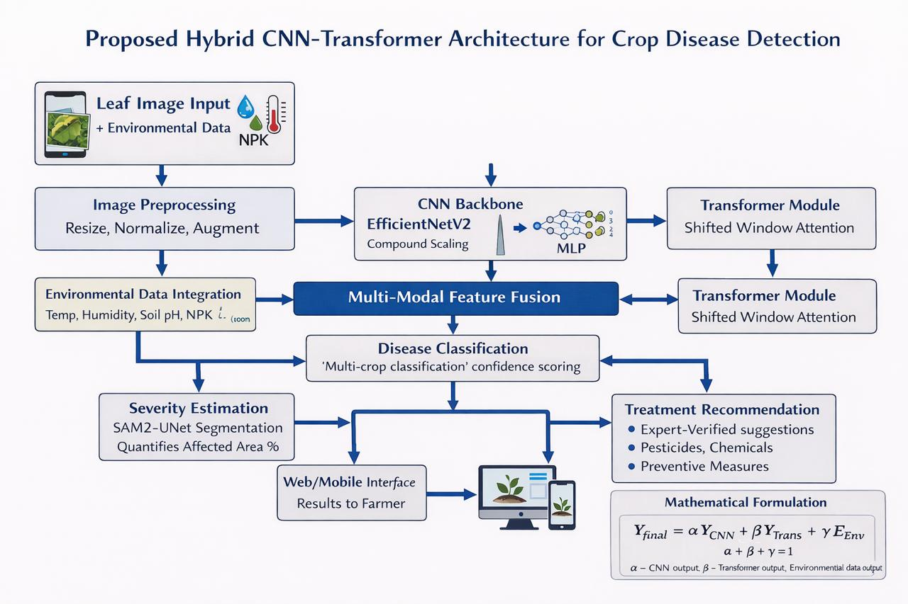

# Project Architecture: AI-Driven Crop Disease Diagnosis

This document visualizes the multi-modal, three-stage intelligent diagnostic pipeline designed for robust field-condition crop disease assessment.

## High-Level System Architecture



*Proposed Hybrid CNN-Transformer Architecture for Crop Disease Detection*

## Logical Workflow Diagram (Mermaid)
graph TD
    subgraph "Input Layer"
        IMG["RGB Image (Crop Leaf)"]
        ENV["Environmental Data<br/>(Temp, Humidity, Rainfall, Soil NPK/pH)"]
    end

    subgraph "Visual Diagnostic Pipeline"
        direction TB
        S1["<b>Stage 1: Classification</b><br/>Swin Transformer<br/>(115 Disease Classes)"]
        S2["<b>Stage 2: Detection</b><br/>DETR (Detection Transformer)<br/>(Lesion Localization)"]
        S3["<b>Stage 3: Segmentation</b><br/>SAM2-UNet<br/>(Pixel-level Severity)"]
        
        S1 --> S2
        S2 --> S3
    end

    subgraph "Environmental Analysis Pipeline"
        GBM["Gradient Boosted Model (GBM)<br/>(Encodes Contextual Risk)"]
    end

    subgraph "Intelligent Fusion Layer"
        FUSION{"Weighted Multi-Modal<br/>Ensemble"}
        
        S3 --> FUSION
        GBM --> FUSION
    end

    subgraph "Output & Decision Support"
        DIAG["Final Diagnosis"]
        MAP["Severity Heatmap (%)"]
        ADVISOR["Multilingual Treatment<br/>Advisor (Hindi/Regional)"]
        
        FUSION --> DIAG
        FUSION --> MAP
        FUSION --> ADVISOR
    end

    IMG --> S1
    ENV --> GBM

    style S1 fill:#f9f,stroke:#333,stroke-width:2px
    style S2 fill:#bbf,stroke:#333,stroke-width:2px
    style S3 fill:#bfb,stroke:#333,stroke-width:2px
    style GBM fill:#fdb,stroke:#333,stroke-width:2px
    style FUSION fill:#fff,stroke:#333,stroke-width:4px
```

## Component Description

1.  **Stage 1: Classification (Swin Transformer)**: Identifies the crop species and primary disease using shifted-window attention.
2.  **Stage 2: Object Detection (DETR)**: Localizes multiple infection sites on a single leaf without anchor-tuning.
3.  **Stage 3: Segmentation (SAM2-UNet)**: Generates precise masks to calculate the percentage of affected leaf area.
4.  **Environmental Fusion**: Uses real-time weather and soil data to cross-verify visual symptoms (e.g., distinguishing between nitrogen deficiency and bacterial wilt).
5.  **Output Advisor**: Provides actionable insights and treatment recommendations in local languages for smallholder farmers.
