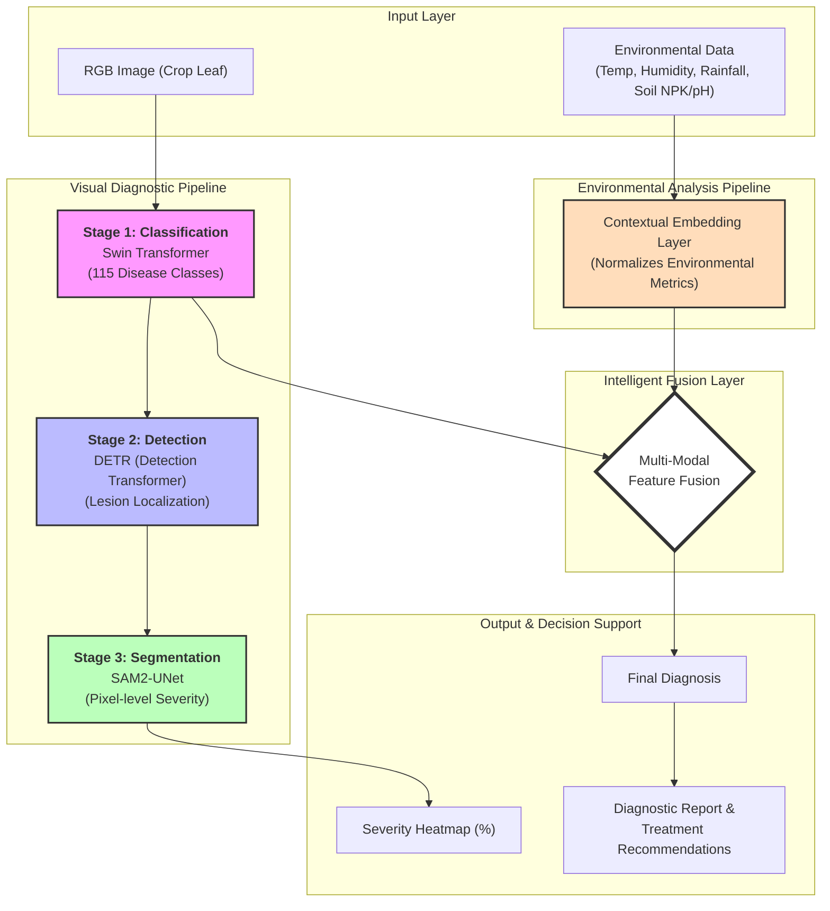

# Project Architecture: AI-Driven Crop Disease Diagnosis

This document visualizes the multi-modal, three-stage intelligent diagnostic pipeline designed for robust field-condition crop disease assessment.

## High-Level System Architecture

*Proposed Hybrid CNN-Transformer Architecture for Crop Disease Detection*

## Logical Workflow Diagram (Mermaid)

## Technical Component Breakdown

### 1. Stage 1: Hierarchical Classification
- **Backbone**: `microsoft/swin-tiny-patch4-window7-224`
- **Mechanism**: Utilizes Shifted-Window Attention to capture multi-scale features, identifying 115 disease classes across 8 crop species.
- **Environmental Fusion**: Integrates scaled environmental tensors (T, H, N, P, K) to resolve visual ambiguities between nutrient deficiencies and early-stage infections.

### 2. Stage 2: Transformer-based Detection (DETR)
- **Model**: Detection Transformer (DETR).
- **Function**: Performs set-based object detection for lesion localization. This stage identifies multiple infection points on a single plant organ, providing spatial context for the severity analysis.

### 3. Stage 3: Severity Segmentation (SAM2-UNet)
- **Model**: Segment Anything Model 2 (SAM2) integrated with UNet skip connections.
- **Function**: Generates high-resolution binary masks of infected tissues.
- **Metric**: Calculates the **Disease Severity Index (DSI)** as the ratio of infected pixels to total leaf pixels.

### 4. Decision Support System
- **Output**: Generates a comprehensive PDF report including disease identification, localized severity map, and treatment advisor.
- **Language Support**: Designed for multilingual accessibility to support diverse agricultural communities in India.
